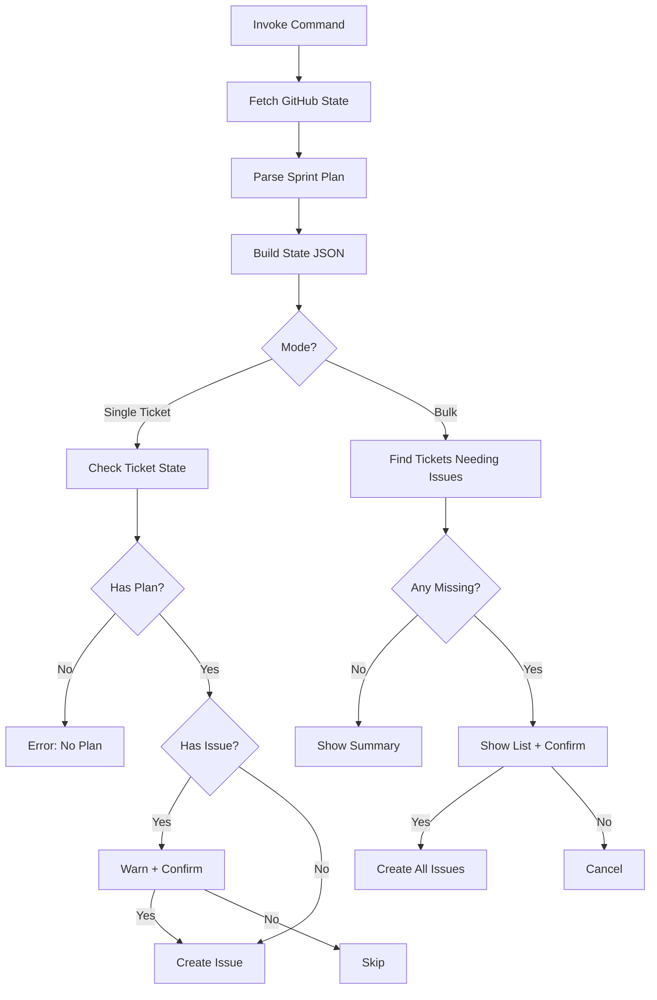

# Run Issue Handler

Intelligently create GitHub issues based on current sprint state, existing issues, and PRs.

## Usage

```bash
# Analyze sprint and create missing issues
@run-issue-handler

# Create issue for specific ticket (with safety check)
@run-issue-handler PROTO-001
```

## Purpose

This command provides intelligent issue management:
1. Fetches current GitHub state (open issues and PRs)
2. Analyzes sprint plan to find tickets with plans
3. Identifies gaps (tickets with plans but no issues)
4. Creates missing issues with user confirmation
5. Prevents duplicate issue creation

## Workflow



## What It Does

### 1. State Analysis

Runs `.cursor/scripts/fetch-github-state.sh` to query GitHub Projects:

**Uses GitHub Projects API** (`gh project item-list`) to get the single source of truth.

**Generated state**:
```json
{
  "timestamp": "2026-03-06T20:30:00Z",
  "project_url": "https://github.com/users/jxtngx/projects/29",
  "sprint_tickets": [
    {
      "ticket_id": "PROTO-001",
      "has_plan": true,
      "plan_file": "proto-001_module_structure_fac33c9f",
      "has_issue": true,
      "issue_number": 43,
      "issue_state": "OPEN",
      "project_status": "In Progress",
      "has_pr": true,
      "pr_number": 2,
      "pr_state": "MERGED",
      "needs_issue": false
    },
    {
      "ticket_id": "PROTO-006",
      "has_plan": true,
      "plan_file": "proto-006_converter_skeleton_cf882e16",
      "has_issue": false,
      "issue_number": null,
      "issue_state": "not_created",
      "project_status": "Not in Project",
      "has_pr": false,
      "pr_number": null,
      "pr_state": "none",
      "needs_issue": true
    }
  ],
  "summary": {
    "total_tickets": 63,
    "in_project": 32,
    "project_number": 29
  }
}
```

Saved to `.cursor/.github-state.json` for reference.

**Why GitHub Projects?**
- Single source of truth for sprint status
- Native GitHub integration
- Status fields already configured
- Relationships automatically tracked
- Checks for closed PRs to avoid creating unnecessary issues

**Smart Issue Detection**:
The `needs_issue` field is `true` only when:
- Ticket has a plan file
- No issue exists yet
- No closed/merged PR exists (work not already done)

### 2. Single Ticket Mode

When a ticket ID is provided:

1. **Validation**: Checks if ticket has a plan file
2. **Duplicate Check**: Warns if issue already exists
3. **Confirmation**: Asks user to confirm if duplicate
4. **Creation**: Creates issue only after confirmation

### 3. Bulk Mode

When no ticket ID is provided:

1. **Gap Analysis**: Finds all tickets with plans but no issues
2. **Summary**: Shows list of tickets needing issues
3. **Confirmation**: Asks user to confirm bulk creation
4. **Batch Creation**: Creates all missing issues with rate limiting

## Output Examples

### Single Ticket (New)

```
Fetching GitHub Projects state...
✓ GitHub Projects state saved to: .cursor/.github-state.json

Summary:
  Total tickets: 63
  In GitHub Project: 32
  With plans: 29
  With issues: 23
  Need issues: 6

View project: https://github.com/users/jxtngx/projects/29

Mode: Single ticket (PROTO-006)

Creating issue for PROTO-006...
Finding sprint epic issue...
Sprint epic: #42

✓ GitHub issue created successfully
✓ Ticket ID: PROTO-006
```

### Single Ticket (Closed PR Exists)

```
Mode: Single ticket (PROTO-001)

✓ Ticket PROTO-001 already has a closed/merged PR: #2
  No issue needed - work is complete
```

```
Mode: Single ticket (PROTO-001)

⚠ Issue already exists for PROTO-002: #44
Create anyway? (y/N): n
Skipped
```

### Bulk Mode (Gaps Found)

```
Fetching GitHub Projects state...

Summary:
  Total tickets: 63
  In GitHub Project: 32
  With plans: 29
  With issues: 23
  Need issues: 6

View project: https://github.com/users/jxtngx/projects/29

Mode: Bulk processing

Found 6 tickets that need issues:
PROTO-006
PROTO-007
PROTO-008
PROTO-009
PROTO-010
API-006

Create issues for all 6 tickets? (y/N): y

Creating issues...
================================

[1/6] Processing: PROTO-006
  ✓ Created

[2/6] Processing: PROTO-007
  ✓ Created

...

================================
Summary:
  Total: 6
  Success: 6
  Failed: 0
================================
```

### Bulk Mode (All Complete)

```
Mode: Bulk processing

✓ All tickets with plans either have issues or closed PRs

Summary from state:
  [PROTO-001] PR: #2 (MERGED) - No issue needed
  [PROTO-002] Issue: #44 | Status: Done
  [PROTO-003] Issue: #45 | Status: In Review
  [PROTO-004] PR: #5 (MERGED) - No issue needed
  ...

View project: https://github.com/users/jxtngx/projects/29
```

## Safety Features

### Duplicate Prevention

- **Detection**: Checks existing issues by title pattern `[TICKET-ID]`
- **Closed PR Check**: Skips tickets with merged/closed PRs (work already done)
- **Warning**: Alerts user if issue already exists
- **Confirmation**: Requires explicit yes to create duplicate
- **Bulk Skip**: Automatically skips tickets with existing issues or closed PRs

### User Confirmation

All bulk operations require confirmation:
- Shows count of issues to be created
- Lists specific ticket IDs
- Waits for `y/Y` response
- Cancels on any other input

### Rate Limiting

- 2-second delay between issue creations
- Prevents GitHub API rate limit errors
- Only applies to bulk operations

## State File

The `.cursor/.github-state.json` file provides:

**Source**: GitHub Projects board at https://github.com/users/jxtngx/projects/29

**Benefits**:
- Single source of truth (GitHub Projects)
- Native status fields (Todo, In Progress, Done, etc.)
- Issue relationships already tracked
- Reference for debugging
- Can be committed for team visibility
- JSON format for easy parsing

**Location**: `.cursor/.github-state.json` (gitignored recommended)

**Refresh**: Regenerated on every run by querying GitHub Projects API

**Data includes**:
- Ticket ID
- Plan file status
- Issue number and state
- Project status field value
- PR number and state (OPEN, MERGED, CLOSED)
- Smart `needs_issue` flag (excludes tickets with closed PRs)
- All from GitHub Projects and PRs API

## Error Handling

| Error | Cause | Resolution |
|-------|-------|------------|
| No plan file | Ticket doesn't have plan | Create plan file first |
| State fetch failed | GitHub API error | Check `gh auth status` |
| Issue exists | Duplicate creation attempt | Cancel or confirm override |
| Plan file TBD | Plan not ready | Wait for plan file creation |

## Integration

Works with:
- `.cursor/scripts/fetch-github-state.sh` - GitHub Projects state fetcher
- `.cursor/scripts/create-github-issue.sh` - Issue creation
- `.cursor/scripts/get-sprint-issue.sh` - Sprint epic management
- Sprint plan frontmatter and tables
- GitHub Projects API (via `gh project` commands)
- GitHub Issues API (via `gh` CLI)

## Use Cases

### Starting a Sprint

```bash
# Create all issues at once
@run-issue-handler
# Confirm: y
```

### Mid-Sprint New Plans

```bash
# Check state and create only missing issues
@run-issue-handler
# Shows: Found 3 tickets that need issues
# Confirm: y
```

### Single Ticket Addition

```bash
# Create one specific issue
@run-issue-handler PROTO-015
```

### Status Check

```bash
# Just view current state (cancel bulk creation)
@run-issue-handler
# Confirm: n
```

## Related Scripts

- `.cursor/scripts/run-issue-handler.sh` - Main handler
- `.cursor/scripts/fetch-github-state.sh` - State fetcher
- `.cursor/scripts/create-github-issue.sh` - Issue creator
- `.cursor/scripts/get-sprint-issue.sh` - Epic manager
- `.cursor/scripts/bulk-create-issues.sh` - Legacy bulk creator (deprecated)

## Migration Note

This command replaces the direct use of:
- `bulk-create-issues.sh` (now deprecated)
- Manual tracking of which issues exist

The intelligent handler provides better safety and automation.
