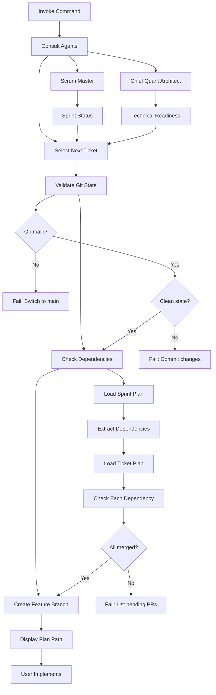
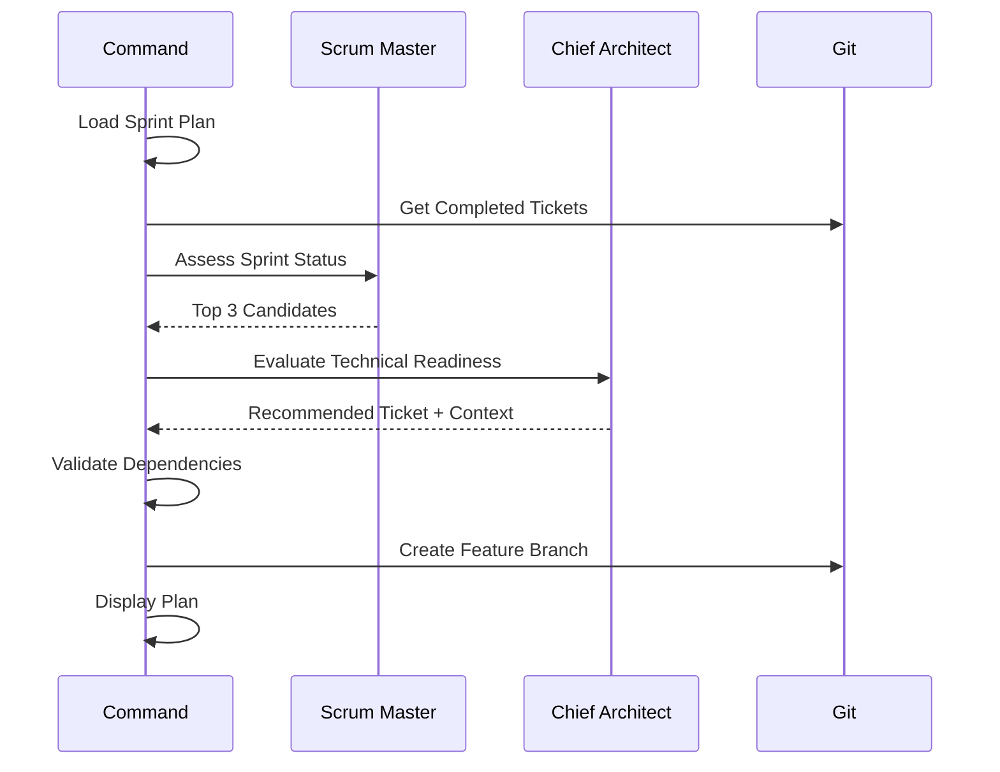

# Run Ticket Plan

Select the next available ticket, validate dependencies, create feature branch, and direct the user to the ticket's plan file for implementation.

## Usage

```
@run-ticket-plan
```

No ticket ID required - the command automatically determines the next ticket to work on.

## Purpose

This command does NOT implement code. It:
1. Selects the optimal next ticket using agent consultation
2. Validates git state and dependencies
3. Creates the feature branch
4. Directs you to the ticket plan file to begin implementation

**You implement from the ticket plan file directly.**

## Workflow



## Steps

### 0. Ticket Selection (Automated)

Consult agents to determine next ticket:

**Scrum Master Assessment** (`.cursor/agents/scrum-master.md`):
- Review sprint plan progress
- Identify completed tickets from git history
- Calculate sprint velocity and capacity
- Filter to tickets with satisfied dependencies
- Prioritize by phase and critical path

**Chief Quant Architect Assessment** (`.cursor/agents/chief-quant-architect.md`):
- Evaluate technical readiness
- Check for architectural blockers
- Verify prerequisite knowledge available
- Assess risk and complexity
- Recommend optimal ticket for current context

**Selection Criteria**:
1. All dependencies merged to main
2. Highest priority in current phase
3. Matches team member specialization (if agent context available)
4. Technically ready (no architectural blockers)
5. Fits within remaining sprint capacity

**Output**: Selected ticket ID (e.g., `PROTO-002`)

### 1. Git State Validation

Verify repository state before starting work:

- Current branch is `main`
- Working directory is clean
- Local main is up to date with remote

### 2. Dependency Resolution

Check ticket dependencies are satisfied:

- Parse sprint plan table for ticket's "Depends On" column
- Parse ticket plan file for dependency mentions
- Verify each dependency ticket has merged PR in git history
- Report any unmerged dependencies with commit search

### 3. Branch Creation

Create feature branch following convention:

- Pattern: `feature/TICKET-ID-short-description`
- Example: `feature/PROTO-002-codec-encode`
- Branch from current main

### 4. Display Plan Path

Provide clear instruction to user:

- Display full path to ticket plan file
- Highlight the plan file for the user to reference
- Summarize key deliverables from plan
- Confirm branch is ready for work

**The user implements from the plan file - the command does NOT auto-implement.**

## Pre-flight Checks

Before executing, validate:

| Check | Command | Expected |
|-------|---------|----------|
| Sprint plan exists | Read `.cursor/plans/sprint_*.plan.md` | File found |
| Agents available | Read `.cursor/agents/scrum-master.md` | File found |
| Agents available | Read `.cursor/agents/chief-quant-architect.md` | File found |
| Current branch | `git branch --show-current` | `main` |
| Clean state | `git status --porcelain` | Empty output |
| Up to date | `git fetch && git status` | No "behind" message |
| Dependencies | `git log --all --grep="[TICKET]"` | Commit exists for each |

## Ticket Selection Process

### Step 1: Gather Sprint Context

Parse sprint plan table to extract:
- All ticket IDs and their status
- Dependency relationships
- Phase groupings
- Current week/phase

Search git history for completed tickets:
```bash
git log --all --oneline | grep -E '\[(PROTO|API|TEST|OBS|DOC)-[0-9]+\]'
```

### Step 2: Consult Scrum Master

Invoke scrum-master agent with context:
- Sprint plan file path
- Completed tickets list
- Current phase

Ask scrum-master to:
1. Identify tickets ready to start (dependencies satisfied)
2. Prioritize by sprint goals and critical path
3. Consider sprint velocity and capacity
4. Return top 3 candidate tickets

### Step 3: Consult Chief Quant Architect

Invoke chief-quant-architect agent with:
- Top 3 candidate tickets from scrum-master
- Current codebase state
- Recent changes or context

Ask chief-quant-architect to:
1. Assess technical readiness for each candidate
2. Identify any architectural blockers
3. Recommend single ticket to work on next
4. Provide technical context for implementation

### Step 4: Final Selection

Select the ticket recommended by chief-quant-architect and proceed with validation and branch creation.

## Dependency Validation

For ticket with dependencies `PROTO-002, PROTO-003`:

1. Search git history: `git log --all --grep="\[PROTO-002\]" --oneline`
2. Verify commit exists on main branch
3. Check commit is merged (not on abandoned branch)
4. Repeat for each dependency

If dependency missing:

- Report unmerged dependency ticket
- List expected commit message pattern: `[TICKET-ID]`
- Block execution until dependencies satisfied

## Branch Naming

Extract short description from ticket plan file:

- Read plan name field
- Convert to kebab-case
- Limit to 50 chars total
- Format: `feature/TICKET-ID-description`

Examples:

- `feature/PROTO-002-codec-encode`
- `feature/API-001-version-update`
- `feature/OBS-003-protocol-logging`

## Error Handling

| Error | Message | Resolution |
|-------|---------|------------|
| Sprint plan not found | `No sprint plan found in .cursor/plans/. Create sprint plan first.` | Create sprint plan file |
| Agent not found | `Agent {name} not found at {path}. Check agent files.` | Verify agent file exists |
| No available tickets | `No tickets ready to start. All available tickets have unmet dependencies.` | Complete dependency tickets first |
| Not on main | `Current branch is {branch}. Switch to main first.` | `git checkout main` |
| Dirty working tree | `Uncommitted changes detected. Commit or stash.` | `git status` |
| Missing dependency | `Dependency {TICKET} not merged. Required PRs: {list}` | Wait for PR merge |
| Plan file not found | `No plan file for {TICKET}. Create plan first.` | Create plan file |
| Branch exists | `Branch feature/{TICKET} exists. Delete or reuse?` | `git branch -D feature/{TICKET}` |
| Agent disagreement | `Scrum master and architect disagree on ticket priority. Manual selection required.` | Provide ticket ID manually |

## Implementation Flow

After successful ticket selection and validation:

1. Display selected ticket ID and rationale
2. Show agent recommendations and context
3. Create feature branch
4. Display ticket plan file path
5. Summarize key deliverables
6. User implements by referencing the plan file directly

**IMPORTANT**: This command only prepares the environment. The user always implements from the ticket plan file (e.g., `@.cursor/plans/proto-001_module_structure_fac33c9f.plan.md`).

## Agent Coordination



## Example Output

```
[TICKET SELECTION]
Scrum Master recommends: PROTO-002, PROTO-003, API-001
  - PROTO-002: Highest priority, critical path
  - PROTO-003: Parallel work opportunity
  - API-001: Independent, can start anytime

Chief Quant Architect recommends: PROTO-002
  - Technical readiness: HIGH
  - Dependencies satisfied: PROTO-001 merged in commit abc123
  - Context: Codec module structure ready, encode logic straightforward
  - Risk: LOW - isolated to codec.py

[SELECTED TICKET]
PROTO-002: Implement ProtobufCodec.encode()

[GIT VALIDATION]
✓ On main branch
✓ Working directory clean
✓ Up to date with origin/main
✓ Dependency PROTO-001 merged

[BRANCH CREATION]
Creating branch: feature/PROTO-002-codec-encode
Branch created successfully

[READY FOR IMPLEMENTATION]
Plan file: @.cursor/plans/proto-002_codec_encode_614da315.plan.md

Use the plan file above to implement this ticket.

Key deliverables:
- Implement ProtobufCodec.encode() method
- Add type hints and docstrings
- Handle encoding errors gracefully

The feature branch is ready. Begin implementation from the plan file.
```
