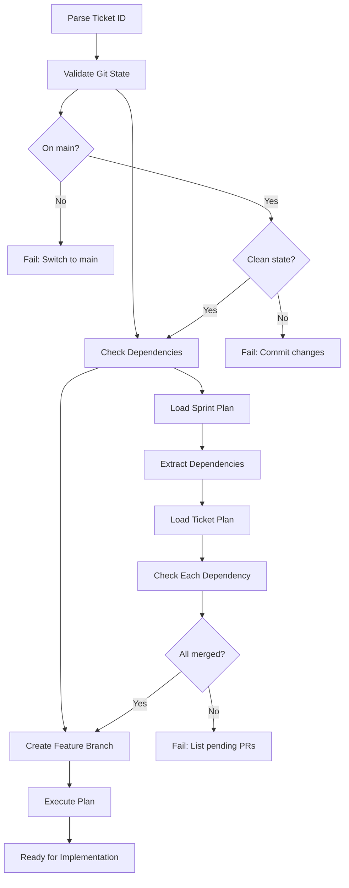

# Run Ticket Plan

Execute a ticket's implementation plan with dependency validation and git workflow.

## Usage

```
@run-ticket-plan TICKET-ID
```

Example: `@run-ticket-plan PROTO-002`

## Workflow



## Steps

### 1. Git State Validation

Verify repository state before starting work:

- Current branch is `main`
- Working directory is clean
- Local main is up to date with remote

### 2. Dependency Resolution

Check ticket dependencies are satisfied:

- Parse sprint plan table for ticket's "Depends On" column
- Parse ticket plan file for dependency mentions
- Verify each dependency ticket has merged PR in git history
- Report any unmerged dependencies with commit search

### 3. Branch Creation

Create feature branch following convention:

- Pattern: `feature/TICKET-ID-short-description`
- Example: `feature/PROTO-002-codec-encode`
- Branch from current main

### 4. Plan Execution

Load and display ticket plan for implementation:

- Read ticket plan file from `.cursor/plans/`
- Display implementation steps
- Show file paths and test requirements
- Provide context for developer

## Pre-flight Checks

Before executing, validate:

| Check | Command | Expected |
|-------|---------|----------|
| Current branch | `git branch --show-current` | `main` |
| Clean state | `git status --porcelain` | Empty output |
| Up to date | `git fetch && git status` | No "behind" message |
| Dependencies | `git log --all --grep="[TICKET]"` | Commit exists for each |

## Dependency Validation

For ticket with dependencies `PROTO-002, PROTO-003`:

1. Search git history: `git log --all --grep="\[PROTO-002\]" --oneline`
2. Verify commit exists on main branch
3. Check commit is merged (not on abandoned branch)
4. Repeat for each dependency

If dependency missing:

- Report unmerged dependency ticket
- List expected commit message pattern: `[TICKET-ID]`
- Block execution until dependencies satisfied

## Branch Naming

Extract short description from ticket plan file:

- Read plan name field
- Convert to kebab-case
- Limit to 50 chars total
- Format: `feature/TICKET-ID-description`

Examples:

- `feature/PROTO-002-codec-encode`
- `feature/API-001-version-update`
- `feature/OBS-003-protocol-logging`

## Error Handling

| Error | Message | Resolution |
|-------|---------|------------|
| Not on main | `Current branch is {branch}. Switch to main first.` | `git checkout main` |
| Dirty working tree | `Uncommitted changes detected. Commit or stash.` | `git status` |
| Missing dependency | `Dependency {TICKET} not merged. Required PRs: {list}` | Wait for PR merge |
| Plan file not found | `No plan file for {TICKET}. Create plan first.` | Create plan file |
| Branch exists | `Branch feature/{TICKET} exists. Delete or reuse?` | `git branch -D feature/{TICKET}` |

## Implementation Flow

After successful validation:

1. Display ticket plan contents
2. Show files to modify from plan
3. Show test files to create/update
4. Provide implementation context
5. Wait for developer to proceed with implementation

The command prepares the environment but does NOT auto-implement code.
