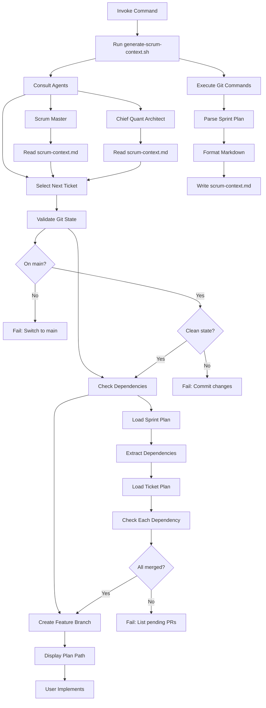
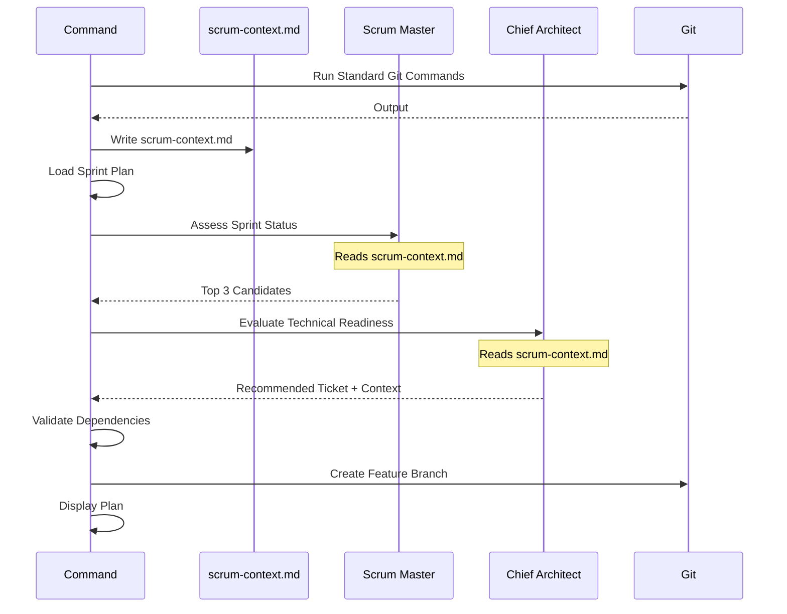

# Run Ticket Plan

Select the next available ticket, validate dependencies, create feature branch, and direct the user to the ticket's plan file for implementation.

## Usage

```
@run-ticket-plan
```

No ticket ID required - the command automatically determines the next ticket to work on.

## Purpose

This command does NOT implement code. It:
1. Selects the optimal next ticket using agent consultation
2. Validates git state and dependencies
3. Creates the feature branch
4. Directs you to the ticket plan file to begin implementation

**You implement from the ticket plan file directly.**

## Workflow



## Steps

### 0. Ticket Selection (Automated)

Consult agents to determine next ticket:

**Scrum Master Assessment** (`.cursor/agents/scrum-master.md`):
- Review sprint plan progress
- Identify completed tickets from git history
- Calculate sprint velocity and capacity
- Filter to tickets with satisfied dependencies
- Prioritize by phase and critical path

**Chief Quant Architect Assessment** (`.cursor/agents/chief-quant-architect.md`):
- Evaluate technical readiness
- Check for architectural blockers
- Verify prerequisite knowledge available
- Assess risk and complexity
- Recommend optimal ticket for current context

**Selection Criteria**:
1. All dependencies merged to main
2. Highest priority in current phase
3. Matches team member specialization (if agent context available)
4. Technically ready (no architectural blockers)
5. Fits within remaining sprint capacity

**Output**: Selected ticket ID (e.g., `PROTO-002`)

### 1. Git State Validation

Verify repository state before starting work:

- Current branch is `main`
- Working directory is clean
- Local main is up to date with remote

### 2. Dependency Resolution

Check ticket dependencies are satisfied:

- Parse sprint plan table for ticket's "Depends On" column
- Parse ticket plan file for dependency mentions
- Verify each dependency ticket has merged PR in git history
- Report any unmerged dependencies with commit search

### 3. Branch Creation

Create feature branch following convention:

- Pattern: `feature/TICKET-ID-short-description`
- Example: `feature/PROTO-002-codec-encode`
- Branch from current main

### 4. Display Plan Path

Provide clear instruction to user:

- Display full path to ticket plan file
- Highlight the plan file for the user to reference
- Summarize key deliverables from plan
- Confirm branch is ready for work

**The user implements from the plan file - the command does NOT auto-implement.**

## Pre-flight Checks

Before executing, validate:

| Check | Command | Expected |
|-------|---------|----------|
| Sprint plan exists | Read `.cursor/plans/sprint_*.plan.md` | File found |
| Agents available | Read `.cursor/agents/scrum-master.md` | File found |
| Agents available | Read `.cursor/agents/chief-quant-architect.md` | File found |
| Script exists | Check `.cursor/scripts/generate-scrum-context.sh` | File found and executable |
| Generate context | Run `.cursor/scripts/generate-scrum-context.sh` | Write `.cursor/plans/scrum-context.md` |
| Current branch | From scrum-context.md | `main` |
| Clean state | From scrum-context.md | `clean` status |
| Up to date | `git fetch && git status` | No "behind" message |
| Dependencies | From scrum-context.md completed tickets | Commit exists for each |

### Script: generate-scrum-context.sh

Location: `.cursor/scripts/generate-scrum-context.sh`

This bash script standardizes all git operations and ensures consistent output format.

**What it does**:
1. Runs all required git commands
2. Captures output into shell variables
3. Parses sprint plan metadata
4. Formats into markdown
5. Writes to `.cursor/plans/scrum-context.md`
6. Reports status to stdout

**Why a script**:
- Enforces consistency across runs
- Eliminates ad-hoc git commands
- Centralizes git query logic
- Makes debugging easier
- Ensures agents always get same format

## Ticket Selection Process

### Step 1: Generate scrum-context.md using script

**CRITICAL**: Run the standardized script to generate `.cursor/plans/scrum-context.md`

Execute the script:

```bash
.cursor/scripts/generate-scrum-context.sh
```

This script is located at `.cursor/scripts/generate-scrum-context.sh` and:

1. Runs all standardized git commands
2. Captures output into variables
3. Parses sprint plan for metadata
4. Writes formatted `.cursor/plans/scrum-context.md`
5. Reports completion status

**Script Operations**:

- Current branch: `git branch --show-current`
- Working status: `git status --porcelain`
- Completed tickets: `git log --all --oneline --grep='\[PROTO-' --grep='\[API-' --grep='\[TEST-' --grep='\[OBS-' --grep='\[DOC-' -n 50`
- Recent commits: `git log --all --oneline -n 20`
- All branches: `git branch -a`
- Sprint metadata: parsed from sprint plan file

**Generated File Structure**:

The script writes `.cursor/plans/scrum-context.md` with sections:
- Current Git State (branch, status)
- Completed Tickets (ticket commits)
- Recent Commits (last 20)
- Available Branches (all branches)
- Sprint Summary (name, total, completed, percentage)
- Usage for Agents (instructions)

### Step 2: Consult Scrum Master

Invoke scrum-master agent with context:
- `.cursor/plans/scrum-context.md` (standardized git state)
- Sprint plan file path

Ask scrum-master to:
1. Review completed tickets from scrum-context.md
2. Identify tickets ready to start (dependencies satisfied)
3. Prioritize by sprint goals and critical path
4. Consider sprint velocity and capacity
5. Return top 3 candidate tickets

### Step 3: Consult Chief Quant Architect

Invoke chief-quant-architect agent with:
- `.cursor/plans/scrum-context.md` (standardized git state)
- Top 3 candidate tickets from scrum-master
- Current codebase state

Ask chief-quant-architect to:
1. Review recent changes from scrum-context.md
2. Assess technical readiness for each candidate
3. Identify any architectural blockers
4. Recommend single ticket to work on next
5. Provide technical context for implementation

### Step 4: Final Selection

Select the ticket recommended by chief-quant-architect and proceed with validation and branch creation.

## Dependency Validation

For ticket with dependencies `PROTO-002, PROTO-003`:

1. Read completed tickets from `.cursor/plans/scrum-context.md`
2. Verify each dependency ticket appears in completed tickets list
3. Check commit exists on main branch (not on abandoned branch)
4. Repeat for each dependency

If dependency missing:

- Report unmerged dependency ticket
- List expected commit message pattern: `[TICKET-ID]`
- Show completed tickets from scrum-context.md
- Block execution until dependencies satisfied

## Branch Naming

Extract short description from ticket plan file:

- Read plan name field
- Convert to kebab-case
- Limit to 50 chars total
- Format: `feature/TICKET-ID-description`

Examples:

- `feature/PROTO-002-codec-encode`
- `feature/API-001-version-update`
- `feature/OBS-003-protocol-logging`

## Error Handling

| Error | Message | Resolution |
|-------|---------|------------|
| Sprint plan not found | `No sprint plan found in .cursor/plans/. Create sprint plan first.` | Create sprint plan file |
| Agent not found | `Agent {name} not found at {path}. Check agent files.` | Verify agent file exists |
| No available tickets | `No tickets ready to start. All available tickets have unmet dependencies.` | Complete dependency tickets first |
| Not on main | `Current branch is {branch}. Switch to main first.` | `git checkout main` |
| Dirty working tree | `Uncommitted changes detected. Commit or stash.` | `git status` |
| Missing dependency | `Dependency {TICKET} not merged. Required PRs: {list}` | Wait for PR merge |
| Plan file not found | `No plan file for {TICKET}. Create plan first.` | Create plan file |
| Branch exists | `Branch feature/{TICKET} exists. Delete or reuse?` | `git branch -D feature/{TICKET}` |
| Agent disagreement | `Scrum master and architect disagree on ticket priority. Manual selection required.` | Provide ticket ID manually |

## Implementation Flow

After successful ticket selection and validation:

1. Display selected ticket ID and rationale
2. Show agent recommendations and context
3. Create feature branch
4. Display ticket plan file path
5. Summarize key deliverables
6. User implements by referencing the plan file directly

**IMPORTANT**: This command only prepares the environment. The user always implements from the ticket plan file (e.g., `@.cursor/plans/proto-001_module_structure_fac33c9f.plan.md`).

## Agent Coordination



## Scrum Context File

The command generates `.cursor/plans/scrum-context.md` by running git commands and capturing their output.

### Implementation Steps

1. Run each standard git command
2. Capture the output
3. Format into markdown sections
4. Write to `.cursor/plans/scrum-context.md`

### Example Generated File

```markdown
# Scrum Context

Generated: 2026-03-06 14:30:00

## Current Git State

**Branch**: main
**Status**: clean

## Completed Tickets

abc1234 [PROTO-001] Create protobuf module structure
def5678 [PROTO-002] Implement ProtobufCodec.encode()
ghi9012 [API-001] Update MaxClientVersion to 222

## Recent Commits (Last 20)

abc1234 [PROTO-001] Create protobuf module structure
def5678 [PROTO-002] Implement ProtobufCodec.encode()
ghi9012 [API-001] Update MaxClientVersion to 222
jkl3456 Update documentation
mno7890 Fix typo in README
...

## Available Branches

* main
  remotes/origin/main
  remotes/origin/feature/PROTO-003-codec-decode

## Sprint Summary

Sprint: Sprint 1 Modernization
Total Tickets: 56
Current Phase: Week 1 - Protocol Foundation
Completed: 3/56 (5%)
```

This file provides consistent input for agent decision-making and is regenerated on every run.

## Example Output

```
[GENERATING SCRUM CONTEXT]
Running: .cursor/scripts/generate-scrum-context.sh

Generating scrum context...
✓ Scrum context written to: .cursor/plans/scrum-context.md
✓ Current branch: main
✓ Status: clean
✓ Completed tickets: 3
✓ Total tickets: 56 (5% complete)

Context file generated successfully

[CONSULTING AGENTS]
Reading scrum-context.md for sprint status...

[TICKET SELECTION]
Scrum Master recommends: PROTO-002, PROTO-003, API-001
  - PROTO-002: Highest priority, critical path
  - PROTO-003: Parallel work opportunity
  - API-001: Independent, can start anytime

Chief Quant Architect recommends: PROTO-002
  - Technical readiness: HIGH
  - Dependencies satisfied: PROTO-001 merged in commit abc123
  - Context: Codec module structure ready, encode logic straightforward
  - Risk: LOW - isolated to codec.py

[SELECTED TICKET]
PROTO-002: Implement ProtobufCodec.encode()

[GIT VALIDATION]
✓ On main branch
✓ Working directory clean
✓ Up to date with origin/main
✓ Dependency PROTO-001 merged

[BRANCH CREATION]
Creating branch: feature/PROTO-002-codec-encode
Branch created successfully

[READY FOR IMPLEMENTATION]
Plan file: @.cursor/plans/proto-002_codec_encode_614da315.plan.md

Use the plan file above to implement this ticket.

Key deliverables:
- Implement ProtobufCodec.encode() method
- Add type hints and docstrings
- Handle encoding errors gracefully

The feature branch is ready. Begin implementation from the plan file.
```
