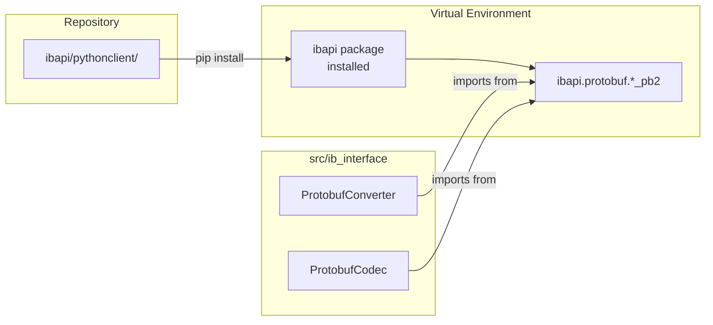

# Update PROTO-005: Use Locally Installed ibapi Package

## Current Approach (To Change)

The current plan instructs copying 204 `*_pb2.py` files from `pythonclient/ibapi/protobuf/` into `src/ib_interface/protobuf/messages/`. This creates maintenance burden and duplication.

## New Approach

Import protobuf messages directly from the **ibapi package** which is installed from the local `ibapi/pythonclient/` directory in the repository. Protobuf support is required (not optional).

## Key Facts

- **ibapi source is at `ibapi/pythonclient/`** in the repository
- **Installed locally**: `pip install ibapi/pythonclient` (already done in venv)
- **Available as package**: Standard imports work: `from ibapi.protobuf.Order_pb2 import Order`
- No copying needed - import directly from installed package

## Architecture Impact




## Changes Required

### 1. Update `[pyproject.toml](pyproject.toml)`

Add ibapi as a local path dependency:

```toml
dependencies = [
    "ibapi @ file:///${PROJECT_ROOT}/ibapi/pythonclient",
    "matplotlib>=3.10.8",
    "numpy>=2.4.2",
    "pandas>=3.0.1",
    "protobuf>=7.34.0",
]
```

Or use uv's workspace/path syntax if preferred.

### 2. Update `[converter.py](src/ib_interface/protobuf/converter.py)`

Add direct imports from ibapi package:

```python
from ibapi.protobuf.Order_pb2 import Order as OrderProto
from ibapi.protobuf.Contract_pb2 import Contract as ContractProto
from ibapi.protobuf.OrderStatus_pb2 import OrderStatus as OrderStatusProto
from ibapi.protobuf.OpenOrder_pb2 import OpenOrder as OpenOrderProto
from ibapi.protobuf.TickPrice_pb2 import TickPrice as TickPriceProto
from ibapi.protobuf.ConfigRequest_pb2 import ConfigRequest
from ibapi.protobuf.ConfigResponse_pb2 import ConfigResponse
```

### 3. Update `[.cursor/plans/proto-005_copy_messages_d46c9214.plan.md](.cursor/plans/proto-005_copy_messages_d46c9214.plan.md)`

Replace the entire plan content:

- Change from "Copy and reorganize" to "Setup local ibapi installation"
- Update tasks to add pyproject.toml dependency and imports
- Verify imports work correctly
- Remove all references to copying 204 files

### 4. Update Sprint Plan

Update `[sprint_1_modernization_e041af8d.plan.md](.cursor/plans/sprint_1_modernization_e041af8d.plan.md)`:

- Line 56: Change "Copy and reorganize protobuf messages" to "Setup ibapi local installation and imports"

## Downstream Impact

All tickets depending on PROTO-005 can now import directly:

- **PROTO-006**: `ProtobufConverter` imports from `ibapi.protobuf.`*
- **PROTO-007-010**: Converter methods use imported message classes directly
- **PROTO-013-016**: Handler methods use `ibapi.protobuf` imports

## Benefits of Local Install Approach

1. **No Duplication**: Use ibapi source directly from installation
2. **Official Source**: Uses unmodified Interactive Brokers code
3. **Version Control**: ibapi source tracked in repo at `ibapi/pythonclient/`
4. **Standard Imports**: Normal Python package imports
5. **Always Available**: Installed as part of project dependencies
6. **Easy Updates**: Update `ibapi/pythonclient/` and reinstall

## Implementation Steps

1. Add ibapi as local path dependency in `pyproject.toml`
2. Run `uv sync` to ensure it's installed in venv
3. Update `converter.py` with direct imports from `ibapi.protobuf.`*
4. Rewrite PROTO-005 plan file completely
5. Update sprint plan PROTO-005 description
6. Test imports: `python -c "from ibapi.protobuf.Order_pb2 import Order"`
7. Verify no import errors
8. Commit with `[PROTO-005]` tag

## Acceptance Criteria

- `ibapi/pythonclient/` source exists in repository
- `ibapi` added to `pyproject.toml` as local path dependency
- `uv sync` installs ibapi successfully
- `converter.py` imports directly from `ibapi.protobuf.`*
- No `messages/` directory created in `src/ib_interface/protobuf/`
- Import test passes: `from ibapi.protobuf.ConfigRequest_pb2 import ConfigRequest`
- All imports work without errors
- PROTO-005 plan reflects local install approach

