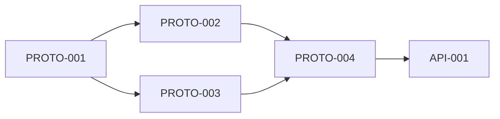
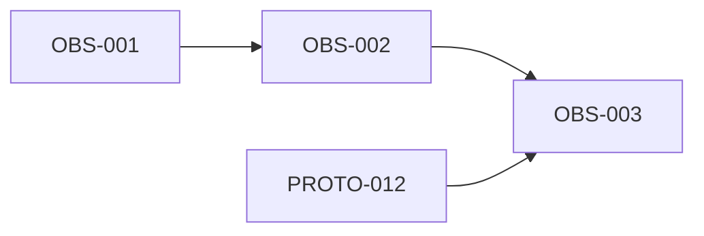
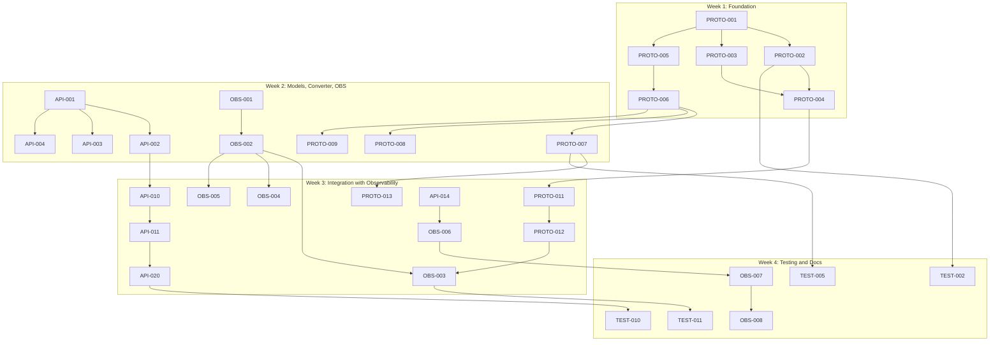

# Sprint 1: ib-interface Modernization

**Duration**: 4 weeks  
**Goal**: Full Protobuf integration while preserving asyncio architecture  
**Definition of Done**: Code + Tests + Review + Documentation

---

## Sprint Backlog

### Phase 1: Protocol Foundation (Week 1)




| Ticket    | GitHub | Completed | Description                                   | Owner        | Depends On           | Plan                                                                                               |
| --------- | ------ | --------- | --------------------------------------------- | ------------ | -------------------- | -------------------------------------------------------------------------------------------------- |
| PROTO-001 | #14    | Yes       | Create protobuf module structure              | Protocol Dev | -                    | [proto-001_module_structure_fac33c9f](.cursor/plans/proto-001_module_structure_fac33c9f.plan.md)   |
| PROTO-002 | #15    | Yes       | Implement ProtobufCodec.encode()              | Protocol Dev | PROTO-001            | [proto-002_codec_encode_614da315](.cursor/plans/proto-002_codec_encode_614da315.plan.md)           |
| PROTO-003 | #16    | Yes       | Implement ProtobufCodec.decode()              | Protocol Dev | PROTO-001            | [proto-003_codec_decode_6b32a8be](.cursor/plans/proto-003_codec_decode_6b32a8be.plan.md)           |
| PROTO-004 | #17    | Yes       | Implement ProtobufCodec.is_protobuf_message() | Protocol Dev | PROTO-002, PROTO-003 | [proto-004_message_detection_593c2f6e](.cursor/plans/proto-004_message_detection_593c2f6e.plan.md) |
| PROTO-005 | #18    | Yes       | Setup ibapi local installation and imports    | Protocol Dev | PROTO-001            | [proto-005_copy_messages_d46c9214](.cursor/plans/proto-005_copy_messages_d46c9214.plan.md)         |


### Phase 2: Converter Layer (Week 1-2)


| Ticket    | GitHub | Completed | Description                             | Owner        | Depends On | Plan                                                                                                   |
| --------- | ------ | --------- | --------------------------------------- | ------------ | ---------- | ------------------------------------------------------------------------------------------------------ |
| PROTO-006 | #19    | No        | Create ProtobufConverter class skeleton | Protocol Dev | PROTO-005  | [proto-006_converter_skeleton_cf882e16](.cursor/plans/proto-006_converter_skeleton_cf882e16.plan.md)   |
| PROTO-007 | #20    | No        | Implement order_from_proto()            | Protocol Dev | PROTO-006  | [proto-007_order_from_proto_b875af92](.cursor/plans/proto-007_order_from_proto_b875af92.plan.md)       |
| PROTO-008 | #21    | No        | Implement order_to_proto()              | Protocol Dev | PROTO-006  | [proto-008_order_to_proto_fb00b278](.cursor/plans/proto-008_order_to_proto_fb00b278.plan.md)           |
| PROTO-009 | #22    | No        | Implement contract_from_proto()         | Protocol Dev | PROTO-006  | [proto-009_contract_from_proto_e4c29f80](.cursor/plans/proto-009_contract_from_proto_e4c29f80.plan.md) |
| PROTO-010 | #23    | No        | Implement bar_data_from_proto()         | Protocol Dev | PROTO-006  | [proto-010_bardata_from_proto_17f3fc06](.cursor/plans/proto-010_bardata_from_proto_17f3fc06.plan.md)   |


### Phase 3: Data Model Updates (Week 2)


| Ticket  | GitHub | Completed | Description                                                             | Owner   | Depends On | Plan                                                                                                 |
| ------- | ------ | --------- | ----------------------------------------------------------------------- | ------- | ---------- | ---------------------------------------------------------------------------------------------------- |
| API-001 | #24    | No        | Update MaxClientVersion to 222                                          | API Dev | -          | [api-001_version_update_1a091c2c](.cursor/plans/api-001_version_update_1a091c2c.plan.md)             |
| API-002 | #25    | No        | Add Order regulatory attributes (customerAccount, professionalCustomer) | API Dev | API-001    | [api-002_order_regulatory_069a8d6e](.cursor/plans/api-002_order_regulatory_069a8d6e.plan.md)         |
| API-003 | #26    | No        | Add Order overnight attributes (includeOvernight)                       | API Dev | API-001    | [api-003_order_overnight_22620b5f](.cursor/plans/api-003_order_overnight_22620b5f.plan.md)           |
| API-004 | #27    | No        | Add Order attached order attributes (slOrderId, ptOrderId, etc.)        | API Dev | API-001    | [api-004_order_attached_29d87707](.cursor/plans/api-004_order_attached_29d87707.plan.md)             |
| API-005 | #28    | No        | Add Order post-only/auction attributes                                  | API Dev | API-001    | [api-005_order_post-only_a3e6eef5](.cursor/plans/api-005_order_post-only_a3e6eef5.plan.md)           |
| API-006 | #29    | No        | Add ContractDetails size precision fields                               | API Dev | -          | [api-006_contractdetails_size_298b2ff9](.cursor/plans/api-006_contractdetails_size_298b2ff9.plan.md) |
| API-007 | #30    | No        | Add ContractDetails fund fields                                         | API Dev | -          | [api-007_contractdetails_fund_c5b20d8b](.cursor/plans/api-007_contractdetails_fund_c5b20d8b.plan.md) |
| API-008 | #31    | No        | Add FundAssetType and FundDistributionPolicyIndicator enums             | API Dev | API-007    | [api-008_fund_enums_d8559486](.cursor/plans/api-008_fund_enums_d8559486.plan.md)                     |


### Phase 4: Observability Foundation (Week 2)




| Ticket  | GitHub | Completed | Description                                      | Owner             | Depends On         | Plan                                                                                                   |
| ------- | ------ | --------- | ------------------------------------------------ | ----------------- | ------------------ | ------------------------------------------------------------------------------------------------------ |
| OBS-001 | #32    | No        | Add OpenTelemetry dependencies to pyproject.toml | Observability Eng | -                  | [obs-001_otel_dependencies_899dad42](.cursor/plans/obs-001_otel_dependencies_899dad42.plan.md)         |
| OBS-002 | #33    | No        | Create telemetry.py with OTel logging bridge     | Observability Eng | OBS-001            | [obs-002_telemetry_module_f9949499](.cursor/plans/obs-002_telemetry_module_f9949499.plan.md)           |
| OBS-003 | #34    | No        | Add protocol type logging to Decoder.interpret() | Observability Eng | OBS-002, PROTO-012 | [obs-003_protocol_type_logging_036e4722](.cursor/plans/obs-003_protocol_type_logging_036e4722.plan.md) |


### Phase 5: Decoder Updates (Week 2-3)


| Ticket    | GitHub | Completed | Description                               | Owner        | Depends On           | Plan                                                                                                           |
| --------- | ------ | --------- | ----------------------------------------- | ------------ | -------------------- | -------------------------------------------------------------------------------------------------------------- |
| PROTO-011 | #35    | No        | Add proto_handlers dict to Decoder        | Protocol Dev | PROTO-004            | [proto-011_proto_handlers_dict_2b750de6](.cursor/plans/proto-011_proto_handlers_dict_2b750de6.plan.md)         |
| PROTO-012 | #36    | No        | Implement _interpret_protobuf() routing   | Protocol Dev | PROTO-011            | [proto-012_interpret_protobuf_cdb423d6](.cursor/plans/proto-012_interpret_protobuf_cdb423d6.plan.md)           |
| PROTO-013 | #37    | No        | Add _handle_order_status_proto handler    | Protocol Dev | PROTO-012, PROTO-007 | [proto-013_order_status_handler_bca745e2](.cursor/plans/proto-013_order_status_handler_bca745e2.plan.md)       |
| PROTO-014 | #38    | No        | Add _handle_open_order_proto handler      | Protocol Dev | PROTO-012, PROTO-009 | [proto-014_open_order_handler_5dc9833c](.cursor/plans/proto-014_open_order_handler_5dc9833c.plan.md)           |
| PROTO-015 | #39    | No        | Add _handle_tick_price_proto handler      | Protocol Dev | PROTO-012            | [proto-015_tick_price_handler_8b92a24b](.cursor/plans/proto-015_tick_price_handler_8b92a24b.plan.md)           |
| PROTO-016 | #40    | No        | Add _handle_config_response_proto handler | Protocol Dev | PROTO-012            | [proto-016_config_response_handler_6315ef02](.cursor/plans/proto-016_config_response_handler_6315ef02.plan.md) |


### Phase 6: Client Updates (Week 3)


| Ticket  | GitHub | Completed | Description                             | Owner   | Depends On         | Plan |
| ------- | ------ | --------- | --------------------------------------- | ------- | ------------------ | ---- |
| API-009 | TBD    | No        | Add _supports_protobuf() method         | API Dev | API-001            | TBD  |
| API-010 | TBD    | No        | Add _send_protobuf() async method       | API Dev | API-009, PROTO-002 | TBD  |
| API-011 | TBD    | No        | Implement reqConfig() method            | API Dev | API-010            | TBD  |
| API-012 | TBD    | No        | Implement updateConfig() method         | API Dev | API-010            | TBD  |
| API-013 | TBD    | No        | Add _should_use_protobuf_order() method | API Dev | API-009            | TBD  |
| API-014 | TBD    | No        | Add _placeOrderProtobuf() method        | API Dev | API-013, PROTO-008 | TBD  |


### Phase 7: Wrapper Updates (Week 3)


| Ticket  | GitHub | Completed | Description                                     | Owner   | Depends On | Plan |
| ------- | ------ | --------- | ----------------------------------------------- | ------- | ---------- | ---- |
| API-015 | TBD    | No        | Add configResponseEvent to Wrapper              | API Dev | -          | TBD  |
| API-016 | TBD    | No        | Implement configResponse() callback             | API Dev | API-015    | TBD  |
| API-017 | TBD    | No        | Add updateConfigResponseEvent                   | API Dev | -          | TBD  |
| API-018 | TBD    | No        | Implement updateConfigResponse() callback       | API Dev | API-017    | TBD  |
| API-019 | TBD    | No        | Update error() callback signature for errorTime | API Dev | -          | TBD  |


### Phase 8: IB Facade Updates (Week 3)


| Ticket  | GitHub | Completed | Description                               | Owner   | Depends On       | Plan |
| ------- | ------ | --------- | ----------------------------------------- | ------- | ---------------- | ---- |
| API-020 | TBD    | No        | Implement getConfigAsync()                | API Dev | API-011, API-016 | TBD  |
| API-021 | TBD    | No        | Implement getConfig() blocking wrapper    | API Dev | API-020          | TBD  |
| API-022 | TBD    | No        | Implement updateConfigAsync()             | API Dev | API-012, API-018 | TBD  |
| API-023 | TBD    | No        | Implement updateConfig() blocking wrapper | API Dev | API-022          | TBD  |


### Phase 9: Key Event Instrumentation (Week 3)


| Ticket  | GitHub | Completed | Description                                           | Owner             | Depends On       | Plan |
| ------- | ------ | --------- | ----------------------------------------------------- | ----------------- | ---------------- | ---- |
| OBS-004 | TBD    | No        | Add connection lifecycle logging (connect/disconnect) | Observability Eng | OBS-002          | TBD  |
| OBS-005 | TBD    | No        | Add error event logging with severity and context     | Observability Eng | OBS-002          | TBD  |
| OBS-006 | TBD    | No        | Add order execution logging (place, status, fill)     | Observability Eng | OBS-002, API-014 | TBD  |


### Phase 10: Testing (Week 3-4)


| Ticket   | GitHub | Completed | Description                                      | Owner    | Depends On               | Plan |
| -------- | ------ | --------- | ------------------------------------------------ | -------- | ------------------------ | ---- |
| TEST-001 | TBD    | No        | Create conftest.py fixtures for protobuf testing | Test Dev | PROTO-005                | TBD  |
| TEST-002 | TBD    | No        | Unit tests for ProtobufCodec.encode()            | Test Dev | PROTO-002                | TBD  |
| TEST-003 | TBD    | No        | Unit tests for ProtobufCodec.decode()            | Test Dev | PROTO-003                | TBD  |
| TEST-004 | TBD    | No        | Unit tests for is_protobuf_message()             | Test Dev | PROTO-004                | TBD  |
| TEST-005 | TBD    | No        | Unit tests for order_from_proto()                | Test Dev | PROTO-007                | TBD  |
| TEST-006 | TBD    | No        | Unit tests for order_to_proto()                  | Test Dev | PROTO-008                | TBD  |
| TEST-007 | TBD    | No        | Unit tests for contract_from_proto()             | Test Dev | PROTO-009                | TBD  |
| TEST-008 | TBD    | No        | Unit tests for new Order attributes              | Test Dev | API-002 thru API-005     | TBD  |
| TEST-009 | TBD    | No        | Unit tests for new ContractDetails attributes    | Test Dev | API-006 thru API-008     | TBD  |
| TEST-010 | TBD    | No        | Integration test for Config API                  | Test Dev | API-020 thru API-023     | TBD  |
| TEST-011 | TBD    | No        | Integration test for dual-protocol decoder       | Test Dev | PROTO-013 thru PROTO-016 | TBD  |


### Phase 11: Documentation (Week 4)


| Ticket  | GitHub | Completed | Description                                    | Owner             | Depends On           | Plan |
| ------- | ------ | --------- | ---------------------------------------------- | ----------------- | -------------------- | ---- |
| DOC-001 | TBD    | No        | Update pyproject.toml with protobuf dependency | Chief Architect   | PROTO-001            | TBD  |
| DOC-002 | TBD    | No        | Document new Order attributes in docstrings    | API Dev           | API-002 thru API-005 | TBD  |
| DOC-003 | TBD    | No        | Document new ContractDetails attributes        | API Dev           | API-006 thru API-008 | TBD  |
| DOC-004 | TBD    | No        | Document Config API usage                      | API Dev           | API-020 thru API-023 | TBD  |
| DOC-005 | TBD    | No        | Update README with migration notes             | Chief Architect   | All                  | TBD  |
| OBS-007 | TBD    | No        | Document SigNoz setup and dashboard config     | Observability Eng | OBS-003 thru OBS-006 | TBD  |
| OBS-008 | TBD    | No        | Document alerting rules configuration          | Observability Eng | OBS-007              | TBD  |


---

## Git Commit Convention

All commits must reference the ticket number:

```
git commit -m "[PROTO-001] Create protobuf module structure"
git commit -m "[API-002] Add customerAccount and professionalCustomer to Order"
git commit -m "[TEST-005] Add unit tests for order_from_proto()"
git commit -m "[OBS-003] Add protocol type logging to Decoder.interpret()"
```

---

## Dependencies Graph




---

## Review Checkpoints


| Week          | Review Focus                                | Reviewer        |
| ------------- | ------------------------------------------- | --------------- |
| End of Week 1 | Protobuf codec correctness                  | Chief Architect |
| End of Week 2 | Data model + OTel foundation                | Chief Architect |
| End of Week 3 | API integration + protocol type logging     | Chief Architect |
| End of Week 4 | Full PR review + observability verification | User            |


