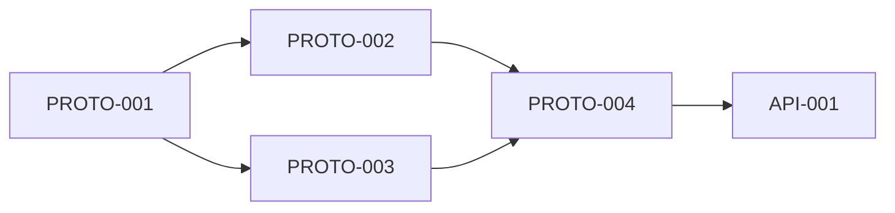
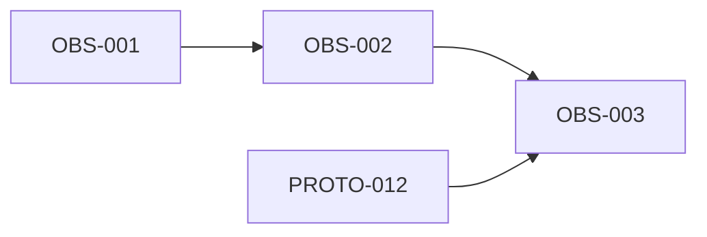
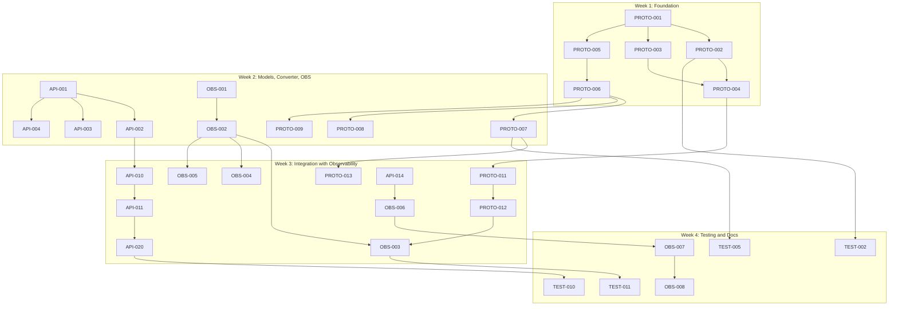

# Sprint 1: ib-interface Modernization

**Duration**: 4 weeks  
**Goal**: Full Protobuf integration while preserving asyncio architecture  
**Definition of Done**: Code + Tests + Review + Documentation

---

## Sprint Backlog

### Phase 1: Protocol Foundation (Week 1)




| Ticket    | Description                                   | Owner        | Depends On           |
| --------- | --------------------------------------------- | ------------ | -------------------- |
| PROTO-001 | Create protobuf module structure              | Protocol Dev | -                    |
| PROTO-002 | Implement ProtobufCodec.encode()              | Protocol Dev | PROTO-001            |
| PROTO-003 | Implement ProtobufCodec.decode()              | Protocol Dev | PROTO-001            |
| PROTO-004 | Implement ProtobufCodec.is_protobuf_message() | Protocol Dev | PROTO-002, PROTO-003 |
| PROTO-005 | Copy and reorganize protobuf messages         | Protocol Dev | PROTO-001            |


### Phase 2: Converter Layer (Week 1-2)


| Ticket    | Description                             | Owner        | Depends On |
| --------- | --------------------------------------- | ------------ | ---------- |
| PROTO-006 | Create ProtobufConverter class skeleton | Protocol Dev | PROTO-005  |
| PROTO-007 | Implement order_from_proto()            | Protocol Dev | PROTO-006  |
| PROTO-008 | Implement order_to_proto()              | Protocol Dev | PROTO-006  |
| PROTO-009 | Implement contract_from_proto()         | Protocol Dev | PROTO-006  |
| PROTO-010 | Implement bar_data_from_proto()         | Protocol Dev | PROTO-006  |


### Phase 3: Data Model Updates (Week 2)


| Ticket  | Description                                                             | Owner   | Depends On |
| ------- | ----------------------------------------------------------------------- | ------- | ---------- |
| API-001 | Update MaxClientVersion to 222                                          | API Dev | -          |
| API-002 | Add Order regulatory attributes (customerAccount, professionalCustomer) | API Dev | API-001    |
| API-003 | Add Order overnight attributes (includeOvernight)                       | API Dev | API-001    |
| API-004 | Add Order attached order attributes (slOrderId, ptOrderId, etc.)        | API Dev | API-001    |
| API-005 | Add Order post-only/auction attributes                                  | API Dev | API-001    |
| API-006 | Add ContractDetails size precision fields                               | API Dev | -          |
| API-007 | Add ContractDetails fund fields                                         | API Dev | -          |
| API-008 | Add FundAssetType and FundDistributionPolicyIndicator enums             | API Dev | API-007    |


### Phase 4: Observability Foundation (Week 2)




| Ticket  | Description                                      | Owner             | Depends On         |
| ------- | ------------------------------------------------ | ----------------- | ------------------ |
| OBS-001 | Add OpenTelemetry dependencies to pyproject.toml | Observability Eng | -                  |
| OBS-002 | Create telemetry.py with OTel logging bridge     | Observability Eng | OBS-001            |
| OBS-003 | Add protocol type logging to Decoder.interpret() | Observability Eng | OBS-002, PROTO-012 |


### Phase 5: Decoder Updates (Week 2-3)


| Ticket    | Description                               | Owner        | Depends On           |
| --------- | ----------------------------------------- | ------------ | -------------------- |
| PROTO-011 | Add proto_handlers dict to Decoder        | Protocol Dev | PROTO-004            |
| PROTO-012 | Implement _interpret_protobuf() routing   | Protocol Dev | PROTO-011            |
| PROTO-013 | Add _handle_order_status_proto handler    | Protocol Dev | PROTO-012, PROTO-007 |
| PROTO-014 | Add _handle_open_order_proto handler      | Protocol Dev | PROTO-012, PROTO-009 |
| PROTO-015 | Add _handle_tick_price_proto handler      | Protocol Dev | PROTO-012            |
| PROTO-016 | Add _handle_config_response_proto handler | Protocol Dev | PROTO-012            |


### Phase 6: Client Updates (Week 3)


| Ticket  | Description                             | Owner   | Depends On         |
| ------- | --------------------------------------- | ------- | ------------------ |
| API-009 | Add _supports_protobuf() method         | API Dev | API-001            |
| API-010 | Add _send_protobuf() async method       | API Dev | API-009, PROTO-002 |
| API-011 | Implement reqConfig() method            | API Dev | API-010            |
| API-012 | Implement updateConfig() method         | API Dev | API-010            |
| API-013 | Add _should_use_protobuf_order() method | API Dev | API-009            |
| API-014 | Add _placeOrderProtobuf() method        | API Dev | API-013, PROTO-008 |


### Phase 7: Wrapper Updates (Week 3)


| Ticket  | Description                                     | Owner   | Depends On |
| ------- | ----------------------------------------------- | ------- | ---------- |
| API-015 | Add configResponseEvent to Wrapper              | API Dev | -          |
| API-016 | Implement configResponse() callback             | API Dev | API-015    |
| API-017 | Add updateConfigResponseEvent                   | API Dev | -          |
| API-018 | Implement updateConfigResponse() callback       | API Dev | API-017    |
| API-019 | Update error() callback signature for errorTime | API Dev | -          |


### Phase 8: IB Facade Updates (Week 3)


| Ticket  | Description                               | Owner   | Depends On       |
| ------- | ----------------------------------------- | ------- | ---------------- |
| API-020 | Implement getConfigAsync()                | API Dev | API-011, API-016 |
| API-021 | Implement getConfig() blocking wrapper    | API Dev | API-020          |
| API-022 | Implement updateConfigAsync()             | API Dev | API-012, API-018 |
| API-023 | Implement updateConfig() blocking wrapper | API Dev | API-022          |


### Phase 9: Key Event Instrumentation (Week 3)


| Ticket  | Description                                           | Owner             | Depends On       |
| ------- | ----------------------------------------------------- | ----------------- | ---------------- |
| OBS-004 | Add connection lifecycle logging (connect/disconnect) | Observability Eng | OBS-002          |
| OBS-005 | Add error event logging with severity and context     | Observability Eng | OBS-002          |
| OBS-006 | Add order execution logging (place, status, fill)     | Observability Eng | OBS-002, API-014 |


### Phase 10: Testing (Week 3-4)


| Ticket   | Description                                      | Owner    | Depends On               |
| -------- | ------------------------------------------------ | -------- | ------------------------ |
| TEST-001 | Create conftest.py fixtures for protobuf testing | Test Dev | PROTO-005                |
| TEST-002 | Unit tests for ProtobufCodec.encode()            | Test Dev | PROTO-002                |
| TEST-003 | Unit tests for ProtobufCodec.decode()            | Test Dev | PROTO-003                |
| TEST-004 | Unit tests for is_protobuf_message()             | Test Dev | PROTO-004                |
| TEST-005 | Unit tests for order_from_proto()                | Test Dev | PROTO-007                |
| TEST-006 | Unit tests for order_to_proto()                  | Test Dev | PROTO-008                |
| TEST-007 | Unit tests for contract_from_proto()             | Test Dev | PROTO-009                |
| TEST-008 | Unit tests for new Order attributes              | Test Dev | API-002 thru API-005     |
| TEST-009 | Unit tests for new ContractDetails attributes    | Test Dev | API-006 thru API-008     |
| TEST-010 | Integration test for Config API                  | Test Dev | API-020 thru API-023     |
| TEST-011 | Integration test for dual-protocol decoder       | Test Dev | PROTO-013 thru PROTO-016 |


### Phase 11: Documentation (Week 4)


| Ticket  | Description                                    | Owner             | Depends On           |
| ------- | ---------------------------------------------- | ----------------- | -------------------- |
| DOC-001 | Update pyproject.toml with protobuf dependency | Chief Architect   | PROTO-001            |
| DOC-002 | Document new Order attributes in docstrings    | API Dev           | API-002 thru API-005 |
| DOC-003 | Document new ContractDetails attributes        | API Dev           | API-006 thru API-008 |
| DOC-004 | Document Config API usage                      | API Dev           | API-020 thru API-023 |
| DOC-005 | Update README with migration notes             | Chief Architect   | All                  |
| OBS-007 | Document SigNoz setup and dashboard config     | Observability Eng | OBS-003 thru OBS-006 |
| OBS-008 | Document alerting rules configuration          | Observability Eng | OBS-007              |


---

## Git Commit Convention

All commits must reference the ticket number:

```
git commit -m "[PROTO-001] Create protobuf module structure"
git commit -m "[API-002] Add customerAccount and professionalCustomer to Order"
git commit -m "[TEST-005] Add unit tests for order_from_proto()"
git commit -m "[OBS-003] Add protocol type logging to Decoder.interpret()"
```

---

## Dependencies Graph




---

## Review Checkpoints


| Week          | Review Focus                                | Reviewer        |
| ------------- | ------------------------------------------- | --------------- |
| End of Week 1 | Protobuf codec correctness                  | Chief Architect |
| End of Week 2 | Data model + OTel foundation                | Chief Architect |
| End of Week 3 | API integration + protocol type logging     | Chief Architect |
| End of Week 4 | Full PR review + observability verification | User            |


