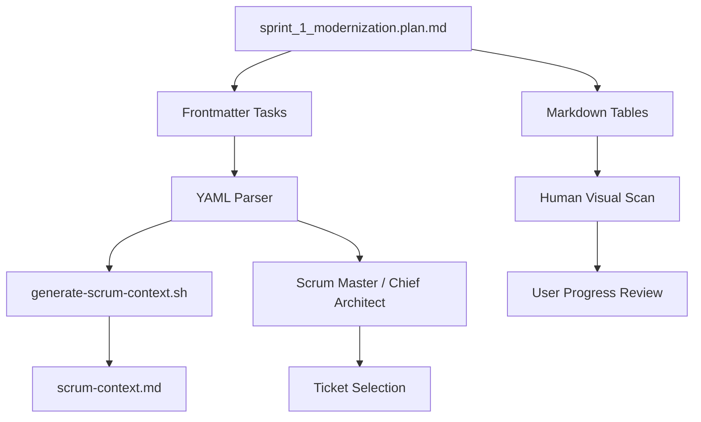

# Update Sprint Plan with Completed Column and Tasks

## Current State

The [sprint_1_modernization_e041af8d.plan.md](.cursor/plans/sprint_1_modernization_e041af8d.plan.md) file has:

- 63 tickets across 11 phases
- Markdown tables with columns: Ticket, Description, Owner, Depends On, Plan
- 6 todos in frontmatter (meta tasks about plan creation)
- No tracking of which tickets are completed

## Proposed Changes

### 1. Add Completed Column to All Tables

Add a new `Completed` column (after `Ticket` column) to all 11 phase tables:


| Ticket    | Completed | Description | Owner | Depends On | Plan |
| --------- | --------- | ----------- | ----- | ---------- | ---- |
| PROTO-001 | Yes       | ...         | ...   | ...        | ...  |
| PROTO-002 | Yes       | ...         | ...   | ...        | ...  |
| PROTO-003 | No        | ...         | ...   | ...        | ...  |


Values: `Yes` or `No`

### 2. Convert Tickets to Frontmatter Tasks

Replace the current 6 meta todos with 63 ticket-level tasks:

```yaml
todos:
  - id: proto-001
    content: PROTO-001 - Create protobuf module structure
    status: completed
  - id: proto-002
    content: PROTO-002 - Implement ProtobufCodec.encode()
    status: completed
  - id: proto-003
    content: PROTO-003 - Implement ProtobufCodec.decode()
    status: pending
  # ... all 63 tickets
```

Status values: `completed` or `pending`

### 3. Benefits

**Completed Column**:

- Quick visual scan of progress in each phase
- Easy to see what's done vs pending
- Aligns with agile board conventions

**Frontmatter Tasks**:

- Programmatic access via frontmatter parsing
- Agents can read task status without parsing markdown tables
- The [generate-scrum-context.sh](.cursor/scripts/generate-scrum-context.sh) script can count completed tasks
- Consistent with Cursor's task management system

### 4. Initial Status Determination

Based on [scrum-context.md](.cursor/plans/scrum-context.md) Recent Commits:

- PROTO-001: Completed (merged PR #2)
- PROTO-002: Completed (merged PR #3)
- PROTO-003: Completed (merged PR #4)
- PROTO-004: Completed (merged PR #5)
- PROTO-005: Completed (merged PR #6)
- All others: Pending

### 5. Architecture Flow




### 6. Update Strategy

1. Add `Completed` column to all 11 phase table headers
2. Add `Yes`/`No` values for each ticket row (5 completed, 58 pending)
3. Replace frontmatter todos with 63 ticket tasks
4. Keep all other content unchanged (descriptions, dependencies, diagrams)

## Questions

None - the approach is straightforward and preserves existing structure.