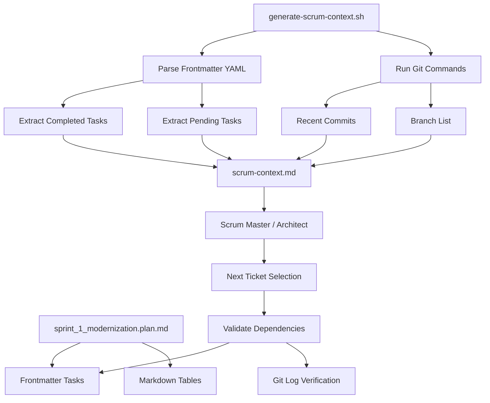

# Update Script and Command for Frontmatter Task Parsing

## Context

After implementing the [sprint plan completion tracking](sprint_plan_completion_tracking_a7750f2c.plan.md), the sprint plan will have:

- 63 tickets as frontmatter tasks with `completed` or `pending` status
- A "Completed" column in all markdown tables

The [generate-scrum-context.sh](.cursor/scripts/generate-scrum-context.sh) script and [run-ticket-plan.md](.cursor/commands/run-ticket-plan.md) command need updates to leverage this new structure.

## Problem with Current Approach

Current script uses git log grep to find completed tickets:

```bash
git log --all --oneline --grep='\[PROTO-' --grep='\[API-' ... -n 50
```

Issues:

- Returns 0 completed tickets (line 12 in scrum-context.md shows "No completed tickets found")
- Commit messages don't follow `[TICKET-ID]` convention consistently
- Merge commits don't include ticket IDs
- Can't distinguish between work-in-progress vs merged PRs

## Proposed Changes

### 1. Update generate-scrum-context.sh

Replace git grep approach with frontmatter YAML parsing:

**Current Logic (lines 25-31)**:

```bash
COMPLETED_TICKETS=$(git log --all --oneline --grep='\[PROTO-' ...)
COMPLETED_COUNT=$(echo "$COMPLETED_TICKETS" | wc -l)
```

**New Logic**:

```bash
# Parse frontmatter tasks from sprint plan
COMPLETED_TASKS=$(awk '/^todos:/,/^[a-z_]+:/ {print}' "$SPRINT_PLAN" | grep -A 1 'status: completed' | grep 'content:' | sed 's/.*content: //')
PENDING_TASKS=$(awk '/^todos:/,/^[a-z_]+:/ {print}' "$SPRINT_PLAN" | grep -A 1 'status: pending' | grep 'content:' | sed 's/.*content: //')
COMPLETED_COUNT=$(echo "$COMPLETED_TASKS" | grep -c 'PROTO\|API\|TEST\|OBS\|DOC' || echo "0")
PENDING_COUNT=$(echo "$PENDING_TASKS" | grep -c 'PROTO\|API\|TEST\|OBS\|DOC' || echo "0")
```

**New scrum-context.md sections**:

```markdown
## Completed Tickets (from Sprint Plan)

PROTO-001 - Create protobuf module structure
PROTO-002 - Implement ProtobufCodec.encode()
...

## Pending Tickets (from Sprint Plan)

PROTO-006 - Create ProtobufConverter class skeleton
PROTO-007 - Implement order_from_proto()
...
```

**Also keep git commits section** for technical context:

```markdown
## Recent Commits (Last 20)
[existing git log output]
```

### 2. Update Script Output Format

Add new sections to scrum-context.md:

```markdown
## Ticket Status Summary

Total Tickets: 63
Completed: 5
Pending: 58
Completion: 7.9%

By Phase:
- Phase 1 (Protocol Foundation): 5/5 (100%)
- Phase 2 (Converter Layer): 0/5 (0%)
- Phase 3 (Data Model Updates): 0/8 (0%)
...
```

### 3. Update run-ticket-plan.md Documentation

Update these sections:

**Step 1: Generate scrum-context.md** (lines 136-158):

- Document that script parses frontmatter tasks
- Explain precedence: frontmatter is source of truth
- Git commits provide technical context only

**Script Operations** (lines 146-152):

```markdown
**Script Operations**:

- Current branch: `git branch --show-current`
- Working status: `git status --porcelain`
- Completed tickets: Parse frontmatter `status: completed` tasks
- Pending tickets: Parse frontmatter `status: pending` tasks
- Recent commits: `git log --all --oneline -n 20`
- All branches: `git branch -a`
- Sprint metadata: parsed from frontmatter and tables
```

**Scrum Context File** (lines 258-290):
Update example to show new format with completed/pending sections

### 4. Dependency Validation Enhancement

**Current** (lines 196-203): Checks git log for dependency commits

**Enhanced**: Cross-reference sprint plan tasks

```markdown
For ticket with dependencies PROTO-002, PROTO-003:

1. Read sprint plan frontmatter tasks
2. Check each dependency has `status: completed`
3. Verify git merge commit exists (validation)
4. Report if mismatch between frontmatter and git

If dependency not completed:
- Show task status from frontmatter
- Show expected git commit pattern
- Block execution
```

## Architecture Flow




## Implementation Steps

1. Update [generate-scrum-context.sh](.cursor/scripts/generate-scrum-context.sh):
  - Add frontmatter parsing logic
  - Replace git grep with YAML parsing
  - Add new output sections
  - Keep git commits for context
2. Update [run-ticket-plan.md](.cursor/commands/run-ticket-plan.md):
  - Update Step 1 documentation
  - Update Script Operations list
  - Update Scrum Context File example
  - Update Dependency Validation section
3. Test script:
  - Run against updated sprint plan
  - Verify completed count matches frontmatter
  - Verify agents can parse output

## Benefits

- **Accurate Tracking**: Single source of truth (frontmatter)
- **No Git Convention Dependency**: Doesn't rely on commit message format
- **Rich Context**: Still provides git history for technical decisions
- **Validation**: Can cross-check frontmatter vs git for discrepancies
- **Phase Reporting**: Can break down completion by phase

