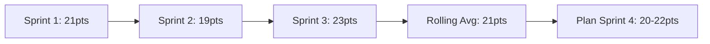

# Sprint Velocity

Track and maintain sustainable team velocity across sprints.

## Calculation

```
Velocity = Sum of completed story points in sprint
Rolling Velocity = Average of last 3 sprints
```

## Measurement Rules

1. **Only Count Done**: Incomplete work carries zero points
2. **No Partial Credit**: Story is 0 or 100% complete
3. **Track Trends**: Watch for patterns over 3+ sprints
4. **Account for Carryover**: Carried work counts in completion sprint only

## Velocity Patterns



## Guidelines

| Scenario | Action |
|----------|--------|
| Velocity dropping | Investigate blockers, technical debt |
| Velocity rising | Verify estimates, check quality |
| High variance | Improve estimation process |
| Consistent | Use for reliable planning |

## Sustainable Pace

- Plan to 80-90% of rolling velocity
- Reserve 10-20% for unplanned work
- Avoid sprint overtime or heroics
- Protect team from burnout

## Anti-Patterns

- Pressuring team to increase velocity
- Comparing velocity between teams
- Using velocity for individual metrics
- Inflating estimates to show progress
