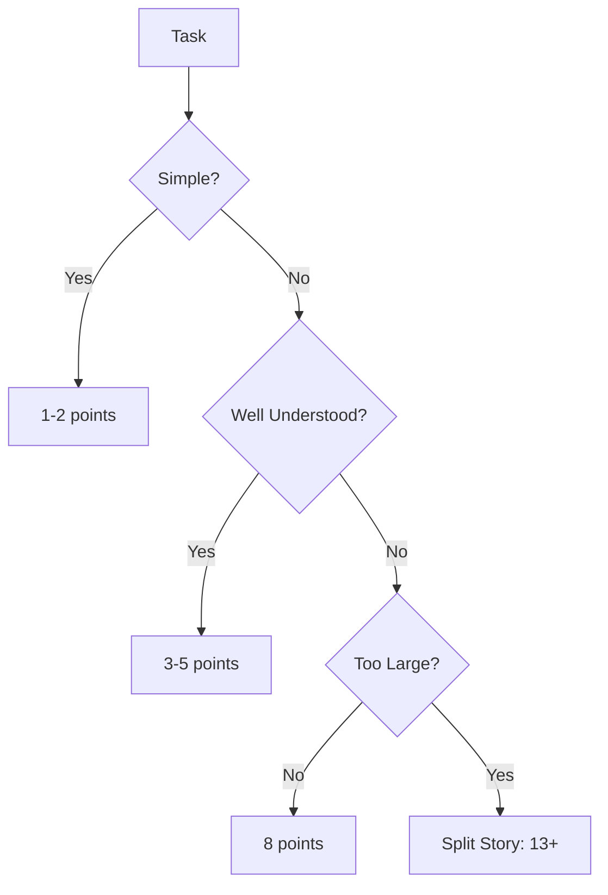

# Story Point Guidelines

Standard for estimating relative complexity using story points.

## Story Point Scale

Use Fibonacci: 1, 2, 3, 5, 8, 13



## Point Definitions

| Points | Complexity | Risk | Duration | Examples |
|--------|------------|------|----------|----------|
| 1 | Trivial | None | 1-2 hours | Add field to dataclass, fix typo |
| 2 | Simple | Low | Half day | Add validation, simple test |
| 3 | Moderate | Low | 1 day | Implement method with tests |
| 5 | Complex | Medium | 2-3 days | New API endpoint with codec |
| 8 | Very Complex | High | 4-5 days | Subsystem refactor with tests |
| 13 | Too Large | - | Split | Epic-level work |

## Estimation Factors

Consider all dimensions:

1. **Technical Complexity**
   - Algorithm difficulty
   - Number of files touched
   - Integration points

2. **Uncertainty**
   - New technology or library
   - Unknown dependencies
   - Ambiguous requirements

3. **Risk**
   - Breaking changes
   - Performance impact
   - Security implications

4. **Testing Effort**
   - Unit test coverage
   - Integration scenarios
   - Mock complexity

## Reference Stories

Anchor estimates to these baseline stories:

```
1 point: Add `reqId` field to ContractDetails dataclass
2 points: Write unit test for ProtobufCodec.encode()
3 points: Implement Order.whatIf() method with tests
5 points: Add new protocol message with encoder/decoder
8 points: Refactor dual-protocol decoder with full test suite
```

## Estimation Rules

1. **Compare, Don't Calculate**: Relative to reference stories
2. **Whole Team Estimates**: Not individual assignments
3. **No Zero or Half Points**: Use defined scale only
4. **13 Means Split**: Break into smaller stories
5. **Re-estimate Only When**: Requirements change significantly

## Common Mistakes

| Mistake | Correction |
|---------|------------|
| Estimating in hours | Use story points for complexity |
| Considering who does it | Estimate for average team member |
| Padding estimates | Be honest, track velocity instead |
| Micro-precision | Use Fibonacci gaps, not 1,2,3,4,5,6... |
