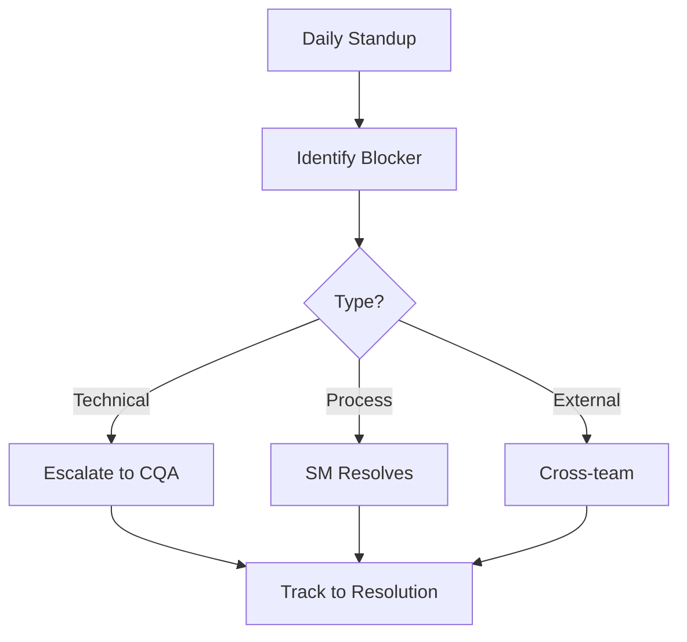

# Blocker Resolution

Identify, track, and remove impediments blocking team progress.

## Blocker Identification



## Blocker Types

| Type | Owner | Resolution |
|------|-------|------------|
| Technical Decision | Chief Quant Architect | Architecture guidance |
| Dependency | Scrum Master | Coordinate with other teams |
| Tooling | Scrum Master | Provision access/resources |
| Process | Scrum Master | Update workflow |
| Knowledge | Team | Pair programming, documentation |

## Tracking Template

```
Blocker: [Short description]
Type: [Technical/Process/External/Knowledge]
Owner: [Who is resolving]
Impact: [What is blocked]
Status: [Open/In Progress/Resolved]
Created: [Date]
Resolved: [Date]
```

## Resolution SLA

- **Critical**: Resolve within 4 hours (blocks multiple developers)
- **High**: Resolve within 1 day (blocks one developer)
- **Medium**: Resolve within 2 days (reduces velocity)
- **Low**: Resolve by sprint end (minor friction)

## Escalation Path

1. **Attempt Resolution**: Try to unblock within 2 hours
2. **Escalate Technical**: Chief Quant Architect for code/architecture
3. **Escalate Cross-Team**: Product Owner for external dependencies
4. **Escalate Management**: For resource or priority conflicts

## Daily Standup Format

Each team member answers:
1. What did you complete yesterday?
2. What will you work on today?
3. What is blocking you?

Focus on blockers, not status reports.
