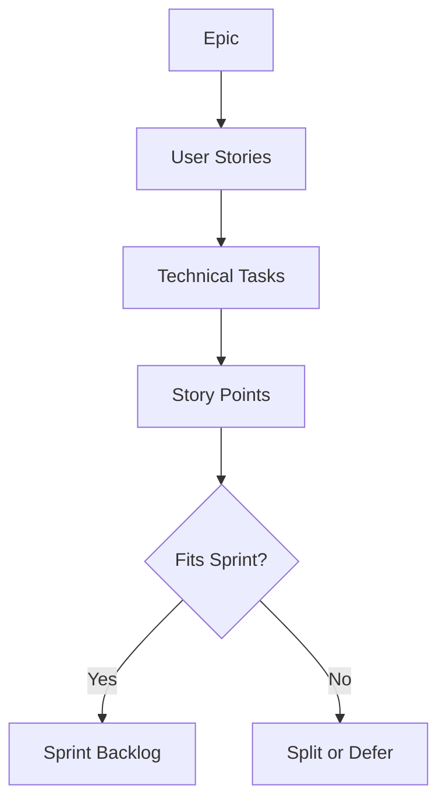

# Sprint Planning

Break epics into sprint-sized tasks with clear acceptance criteria.

## Process

1. **Review Backlog**: Understand priority and dependencies
2. **Estimate Capacity**: Calculate team velocity and availability
3. **Break Down Work**: Split large tasks into implementable chunks
4. **Define Done**: Set measurable acceptance criteria
5. **Commit**: Team agrees to sprint goal

## Task Breakdown



## Acceptance Criteria Template

```
Given [context]
When [action]
Then [expected result]
```

## Capacity Planning

- **Velocity**: Average story points from last 3 sprints
- **Availability**: Account for PTO, holidays, meetings
- **Buffer**: Reserve 20% for unplanned work

## Story Point Guidelines

| Points | Complexity | Duration |
|--------|------------|----------|
| 1 | Trivial | < 2 hours |
| 2 | Simple | Half day |
| 3 | Moderate | 1 day |
| 5 | Complex | 2-3 days |
| 8 | Very Complex | 1 week |
| 13 | Too Large | Split required |

## Sprint Goal

Every sprint must have ONE clear goal:
- Measurable outcome
- Adds user/system value
- Achievable within sprint
- Aligned with product roadmap
