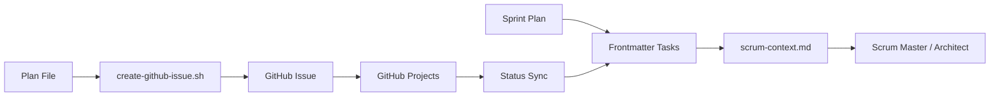

# GitHub Issue Templates

This directory contains issue templates for the ib-interface project.

## Available Templates

### 1. Bug Report (`bug_report.yml`)
For reporting bugs and issues with the library.

### 2. Feature Request (`feature_request.yml`)
For requesting new features or enhancements.

### 3. Cursor Plan (`cursor_plan.yml`)
For creating tickets that correspond to cursor plan files.

### 4. Sprint Epic (`sprint_template.yml`)
For creating sprint epics to track tickets. Individual ticket issues link as sub-issues using "Part of #N".

### 5. User Story (`user_story.yml`)
Simple template for user stories: As a [role], I want [feature] so that [benefit].

## Cursor Plan Template

The cursor plan template is designed to integrate with the cursor-based development workflow.

### When to Use

Use this template when:
- Creating a GitHub issue for a sprint ticket
- Linking a cursor plan to GitHub Projects
- Tracking ticket status in GitHub alongside the sprint plan

### Fields

| Field | Description | Required |
|-------|-------------|----------|
| Ticket ID | Unique ID (PROTO-XXX, API-XXX, etc.) | Yes |
| Plan File | Path to cursor plan file | Yes |
| Sprint Phase | Which phase of sprint (1-11) | Yes |
| Owner | Team member responsible | Yes |
| Description | Brief summary of ticket | Yes |
| Dependencies | Other tickets that must complete first | No |
| Deliverables | Key outputs/tasks | Yes |
| Definition of Done | Completion criteria | Yes |
| Technical Notes | Implementation details | No |
| Status | Current status | Yes |
| Blockers | What's blocking (if applicable) | No |

### Automated Issue Creation

Use the provided scripts to create issues automatically from plan files:

#### Create Single Issue

```bash
.cursor/scripts/create-github-issue.sh PROTO-001
```

This script:
1. Looks up the ticket ID in the sprint plan
2. Extracts ticket type (proto, api, test, obs, doc) for labeling
3. Finds the associated plan file
4. Extracts ticket ID, description, deliverables
5. Creates a GitHub issue using `gh` CLI
6. Applies `cursor-plan`, `ticket`, and type-specific labels

#### Create All Issues (Bulk)

```bash
.cursor/scripts/bulk-create-issues.sh
```

This script:
1. Reads the sprint plan file
2. Finds all plan files referenced
3. Creates issues for each plan
4. Includes rate limiting (2s between calls)
5. Reports success/failure summary

### Integration with Sprint Planning

The sprint ticket template connects to:

- **Sprint Plan**: `.cursor/plans/sprint_1_modernization_e041af8d.plan.md`
  - Contains all 63 tickets
  - Has frontmatter tasks with status
  - Tables with completion tracking

- **Scrum Context**: `.cursor/plans/scrum-context.md`
  - Generated by `generate-scrum-context.sh`
  - Lists completed vs pending tickets
  - Provides git context

- **GitHub Projects**: Can sync ticket status to project board
  - Use `sync-github-projects.sh` (future)
  - Two-way sync between plan and GitHub

### Workflow



## Prerequisites

### GitHub CLI

Install the GitHub CLI tool:

```bash
# macOS
brew install gh

# Linux
sudo apt install gh

# Authenticate
gh auth login
```

### Permissions

Ensure your GitHub token has:
- `repo` scope (create issues)
- `project` scope (if using GitHub Projects)

## Examples

### Manual Issue Creation

Use the GitHub web UI with the cursor plan template:
1. Go to Issues → New Issue
2. Select "Cursor Plan" template
3. Fill in all fields
4. Submit

### Script-based Creation

```bash
# Single ticket
.cursor/scripts/create-github-issue.sh PROTO-001

# All tickets with plan files
.cursor/scripts/bulk-create-issues.sh
```

### Updating Issue Status

When a ticket is completed:
1. Update sprint plan frontmatter: `status: completed`
2. Update sprint plan table: `Completed: Yes`
3. Run sync script (if available): `./.cursor/scripts/sync-github-projects.sh`
4. Or manually update GitHub issue status

## Best Practices

1. **Ticket ID Convention**: Use format `PREFIX-NNN` where prefix is PROTO, API, TEST, OBS, or DOC
2. **Automatic Labels**: Issues automatically get labeled with their type (proto, api, test, obs, doc)
3. **One Issue Per Plan**: Each cursor plan should have exactly one GitHub issue
4. **Link PRs**: Reference the ticket ID in PR titles: `[PROTO-001] Create module structure`
5. **Status Sync**: Keep sprint plan and GitHub status in sync

## Troubleshooting

### Issue: `gh` command not found
**Solution**: Install GitHub CLI: `brew install gh`

### Issue: Authentication failed
**Solution**: Run `gh auth login` and follow prompts

### Issue: Rate limit exceeded
**Solution**: Increase delay in `bulk-create-issues.sh` or run fewer at a time

### Issue: Plan file not found
**Solution**: Verify path relative to project root, ensure plan file exists in `.cursor/plans/`

### Issue: Ticket not found in sprint plan
**Solution**: Verify ticket ID exists in sprint plan table, check spelling (e.g., `PROTO-001` not `proto-001`)
