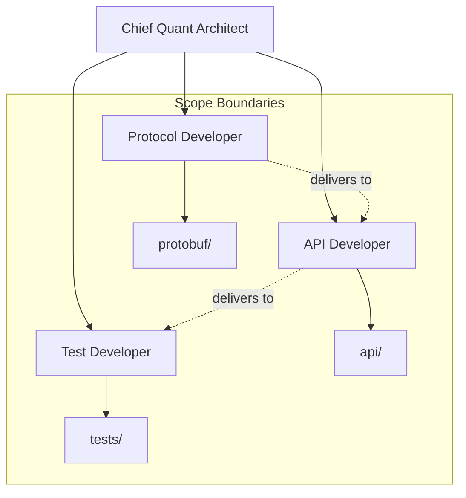
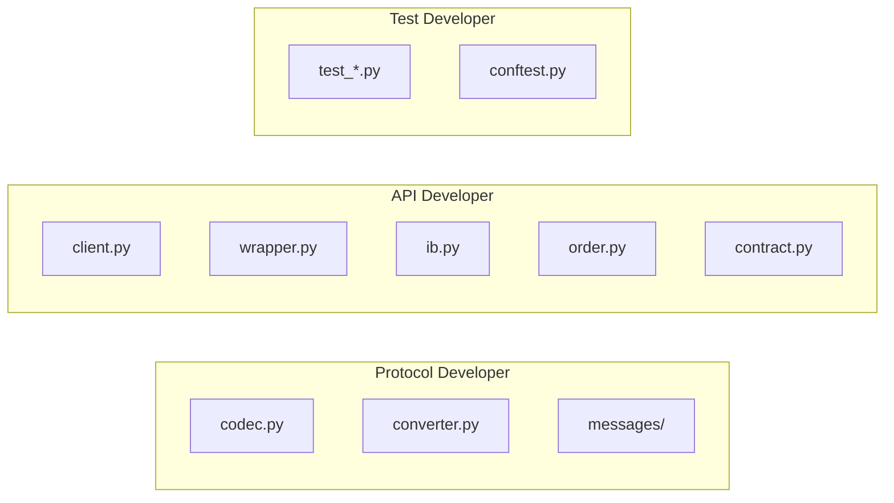
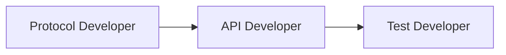

# Agent Creation Plan: ib-interface Modernization

**Author**: Chief Quantitative Developer  
**Status**: Complete

---

## 1. Agent Architecture



---

## 2. Created Agents

| Agent | File | Scope |
|-------|------|-------|
| Chief Quant Architect | `.cursor/agents/chief-quant-architect.md` | Architecture, coordination, approval |
| Protocol Developer | `.cursor/agents/protocol-developer.md` | Protobuf codec, converter, messages |
| API Developer | `.cursor/agents/api-developer.md` | Client, wrapper, IB facade, dataclasses |
| Test Developer | `.cursor/agents/test-developer.md` | Unit tests, integration tests, CI/CD |

---

## 3. Scope Isolation

Each agent has explicit boundaries to prevent overlap:



---

## 4. Delegation Protocol

When the Chief Architect delegates to a subagent:

1. **Specify scope**: Which files to modify
2. **State constraints**: What NOT to change
3. **Define deliverables**: Expected output
4. **Require tests**: Coverage expectations

---

## 5. Execution Order



| Phase | Agent | Deliverable |
|-------|-------|-------------|
| 1 | Protocol Developer | `protobuf/` module with codec, converter, messages |
| 2 | API Developer | Updated client, wrapper, dataclasses |
| 3 | Test Developer | Test suite with coverage |

---

## 6. Agent Invocation

To invoke a subagent, reference the agent file:

```
@.cursor/agents/protocol-developer.md implement the ProtobufCodec class
```

```
@.cursor/agents/api-developer.md add the includeOvernight attribute to Order
```

```
@.cursor/agents/test-developer.md write unit tests for ProtobufCodec
```

---

## 7. Completion Criteria

| Agent | Done When |
|-------|-----------|
| Protocol Developer | codec.py, converter.py, messages/ exist and pass unit tests |
| API Developer | MaxClientVersion=222, all new attributes added, config API works |
| Test Developer | All tests pass, coverage threshold met |

---

*Agents created and ready for delegation.*
